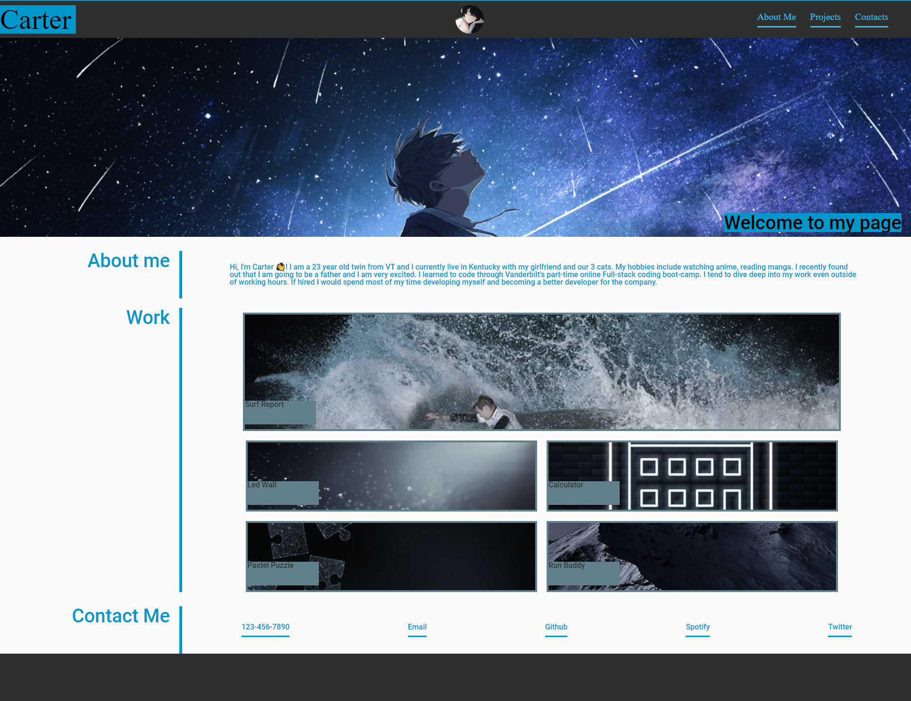

# Module-2-Challenge Portfolio
***

## Description
***
Welcome to my portfolio page! I made this portfolio to present my current skill-set to future employers. In my portfolio you can see my past projects as well as how to contact me.
***

## Table of Contents
***
1. About-me description.

2. Past projects: Surf Report, Led-Wall, Calculator, Pastel-Puzzle, Run-Buddy.

3. Contact links.

## Screenshot

## Installation
***

N/A

## Usage
***
To use this portfolio, you can scroll through the page or click the links in the header to view contents within the website. Click on the various projects that I have created to view them. You can also click on my contact links to view how to get into touch with me. 

## Credits
***
N/A

## License
***
Please refer to the LICENSE in the repo.

